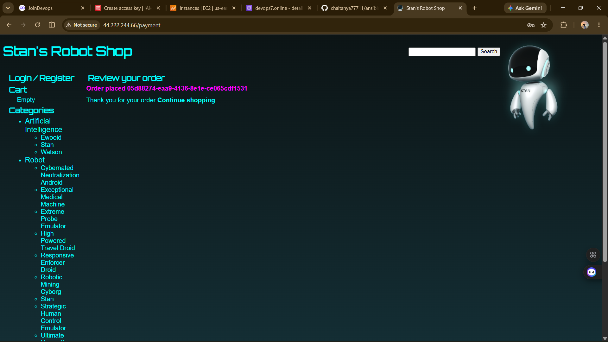

# Roboshop Deployment using Ansible

## About the Project

This project is my practice project to learn Ansible and AWS. I deployed the Roboshop microservices application on AWS EC2 instances using Ansible.

I created separate Ansible playbooks for each service and also a main playbook to deploy the complete application. While working on this project, I learned how to automate server configuration, install required software, configure services, and troubleshoot deployment issues.

This project helped me understand how different microservices work together in a real-world application.

---

## Application Screenshot

The application was successfully deployed and tested.



---

## Technologies Used

- AWS EC2
- Ansible
- Git & GitHub
- Nginx
- Node.js
- Java
- Maven
- Python
- MongoDB
- MySQL
- Redis
- RabbitMQ

---

## Services Included

- Frontend
- Catalogue
- User
- Cart
- Shipping
- Payment
- Dispatch
- MongoDB
- MySQL
- Redis
- RabbitMQ

---

## Project Files

- `roboshop.yaml` - Deploys the complete application
- `frontend.yaml` - Frontend setup
- `catalogue.yaml` - Catalogue service
- `user.yaml` - User service
- `cart.yaml` - Cart service
- `shipping.yaml` - Shipping service
- `payment.yaml` - Payment service
- `dispatch.yaml` - Dispatch service
- `mongodb.yaml` - MongoDB setup
- `mysql.yaml` - MySQL setup
- `redis.yaml` - Redis setup
- `rabbitmq.yaml` - RabbitMQ setup

---

## How to Run

To deploy the complete application:

```bash
ansible-playbook -i inventory.ini roboshop.yaml
```

To deploy an individual service:

```bash
ansible-playbook -i inventory.ini frontend.yaml
```

Replace `frontend.yaml` with the required service playbook if you want to deploy a different service.

---

## What I Learned

During this project, I learned:

- Writing Ansible playbooks
- Deploying applications on AWS EC2
- Managing multiple Linux servers
- Configuring Nginx as a reverse proxy
- Working with MongoDB, MySQL, Redis, and RabbitMQ
- Troubleshooting deployment and service issues
- Automating application deployment using Ansible

---

## Author

**Sai Chaitanya**

GitHub: https://github.com/chaitanya77711
